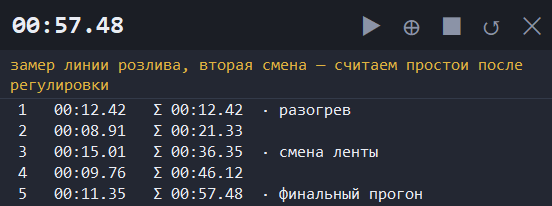

<div align="center">
  
  <h1>Мини-секундомер</h1>
  <p>Компактный секундомер-оверлей для Windows: одна строка поверх других окон,
  круги с комментариями, экспорт в CSV.</p>
  
</div>

## Зачем

Обычный секундомер занимает пол-экрана и теряется под окнами. Этот висит одной
строкой поверх всего, не мешает работе и умеет то, ради чего обычно лезут в блокнот:
разбивать замер на отрезки, подписывать их и выгружать в таблицу.

- **Одна строка в покое.** Окно без рамки, высотой в строку таймера.
- **Поверх всех окон**, перетаскивается за верхнюю полосу, прозрачность крутится колесом.
- **Круги.** Каждый круг уходит строкой ниже, счёт начинается заново — окно растёт
  вниз до 8 строк, дальше прокрутка.
- **Стоп с итогом.** Останавливает серию и оставляет в табло сумму всего времени.
- **Комментарии** к каждому кругу и общий комментарий ко всей серии.
- **Экспорт** в буфер обмена и в CSV, который Excel открывает без импорта.
- **Настройка без кода**: размеры, шрифты, цвета, значки кнопок — в `config.json`.

## Установка

**Готовый exe** — скачать `secundomer.exe` из [Releases](../../releases) и запустить.
Python не нужен, установка не требуется. Настройки лягут в `config.json` рядом с exe.

**Из исходников** — нужен Python 3.10+ с tkinter (в стандартной установке с python.org он есть):

```
git clone https://github.com/Denvtk/mini-stopwatch.git
cd mini-stopwatch
start-secundomer.vbs
```

`start-secundomer.vbs` запускает через `pythonw` без окна консоли; `start-secundomer.bat` — то же самое.

Ярлык на рабочем столе (PowerShell, выполнять в папке проекта):

```powershell
$s = (New-Object -ComObject WScript.Shell).CreateShortcut("$env:USERPROFILE\Desktop\Секундомер.lnk")
$s.TargetPath = "$PWD\start-secundomer.vbs"
$s.WorkingDirectory = "$PWD"
$s.Save()
```

## Кнопки

| Кнопка | Действие |
|---|---|
| ▶ | старт; во время отсчёта превращается в ❚❚ — пауза с сохранением накопленного |
| ⊕ | круг: результат уходит строкой ниже, счёт начинается с нуля и сразу идёт дальше |
| ■ | стоп: записывает последний отрезок строкой и останавливает отсчёт — в табло остаётся сумма всей серии, а не нули |
| ↺ | сброс: обнуляет таймер и чистит список (спрашивает подтверждение) |
| ✕ | закрыть (спрашивает подтверждение, если есть результаты) |

Разница между ⊕ и ■: круг продолжает замер дальше, стоп — завершает серию.
Отрезок короче `lap_min_seconds` (0,05 с) не записывается — защита от двойного клика.

## Горячие клавиши

Работают, когда окно в фокусе (клик по нему):

| Клавиши | Действие |
|---|---|
| `Пробел` | старт / пауза |
| `Enter` | круг |
| `Ctrl+Enter` | стоп с записью итога |
| `F2` | комментарий к выделенному (или последнему) кругу |
| `Shift+F2` | общий комментарий ко всей серии |
| `Ctrl+R` | сброс |
| `Ctrl+Q` | закрыть |

Глобальных хоткеев (когда фокус в другом приложении) нет — для них нужна
сторонняя библиотека вроде `keyboard`.

## Комментарии

**К отдельному кругу:**

- **Двойной клик** по строке или **F2** — поле ввода открывается прямо поверх строки.
- `Enter` — сохранить, `Esc` — отменить.
- Комментарий показывается после итога через `·`; при первом комментарии окно
  расширяется на `comment_width` пикселей и сужается обратно, когда комментариев не осталось.
- Правый клик по строке → «Добавить/Изменить комментарий к кругу N» или «Очистить комментарий».

**Общий комментарий ко всей серии:**

- **Shift+F2** или пункт меню «Добавить/Изменить общий комментарий».
- Отдельная строка под таймером; переносится по словам во всю ширину окна
  и растит окно вниз на нужное число строк.
- Поле правки многострочное: перенос виден сразу во время набора, мышью можно
  ставить курсор и выделять текст. Пустой ввод убирает строку.
- Сбрасывается вместе с результатами по кнопке ↺.

## Управление окном

- **Перетаскивание** — левой кнопкой за верхнюю полосу (шапку с таймером).
- **Прозрачность** — колесо мыши **над верхней полосой** (от 35 % до 100 %).
  Над списком колесо прокручивает записи и прозрачность не трогает.
- **Правый клик** — меню: «✔ Поверх всех окон», комментарии, «Копировать результаты»,
  «Сохранить в CSV…», «Сброс», «Выход».

Окно без системной рамки, поэтому его нет в панели задач и в Alt+Tab —
закрывать через ✕ или `Ctrl+Q`. Меню рисуется системной темой Windows (светлое):
цвета пунктов tk приложению не отдаёт.

## Экспорт

- **Копировать результаты** — `номер⇥отрезок⇥итого⇥комментарий`, вставляется в Excel.
- **Сохранить в CSV** — разделитель `;`, десятичная запятая, кодировка UTF-8 BOM.
  Общий комментарий идёт первой строкой с префиксом `# `.

## Настройка: config.json

Файл лежит рядом с программой (для exe — рядом с exe), читается при запуске и
переписывается при выходе. Полный набор значений по умолчанию — в `config-example.json`.
**Править при закрытом приложении**, иначе изменения затрутся при выходе.

| Секция | Что настраивает |
|---|---|
| `window` | `width`, `header_height` — размеры в логических пикселях (масштаб экрана применяется сам); `max_visible_rows` — сколько кругов видно до прокрутки; `comment_width` — насколько окно расширяется под комментарии; `alpha` — прозрачность; `topmost` — поверх всех окон; `x`, `y` — позиция (`null` = правый верхний угол) |
| `fonts` | `timer`, `row`, `button`, `dialog` — `["Имя шрифта", размер, "стиль"]` |
| `colors` | `bg`, `list_bg`, `fg`, `fg_dim`, `running` (таймер на ходу), `paused`, `hover`, `separator`, `accent` (комментарии и рамка поля) |
| `icons` | символы кнопок: `start`, `pause`, `lap`, `stop`, `reset`, `close` — если шрифт не рисует символ, поставьте свой (например `"II"` вместо `"❚❚"`) |
| `behavior` | `confirm_close`, `confirm_reset` — спрашивать подтверждение; `tick_ms` — шаг перерисовки; `lap_min_seconds` — минимальная длина круга |

Подтверждение при закрытии и сбросе не спрашивается, когда терять нечего
(список пуст и таймер на нуле).

## Сборка exe

```
pip install pyinstaller pillow
python make-icon.py
pyinstaller --noconfirm --onefile --windowed --icon secundomer.ico --name secundomer secundomer.py
```

Готовый файл появится в `dist/secundomer.exe` (~10 МБ, всё внутри).

## Как это устроено

Один файл `secundomer.py` на стандартном tkinter, без внешних зависимостей.
Время считается от `time.perf_counter()`, поэтому перерисовка не накапливает дрейф.
Приложение объявляет себя DPI-aware — на экранах с масштабом 125/150 % текст
остаётся чётким, а размеры пересчитываются от реального DPI.

## Лицензия

[MIT](LICENSE)
